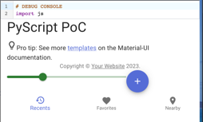

# Full Python react app

An PoC to build a React MUI app with close to no JS.



## Setup

To use NPM packages within pyscript/pyodide we create an `index.ts` module, 
which aggregates all required modules and exports them.
([Module exports](https://developer.mozilla.org/en-US/docs/Web/JavaScript/Reference/Statements/export?retiredLocale=de))

ESBuild is used to bundle the file, which also gathers required modules from installed npm packages. The generated `imports.js` can be used to access the modules.

A script tag within the `index.html` is used to import the `imports.js` and stores all imports under `globalThis.npm`.

Any package can be used from pyscript by `from js.npm import <class>`.


### Requirements

**Python**: for the server
**NPM**: download packages 
**ESBuild**: bundle packages


### Build 

```
npx esbuild --bundle ./index.ts --outfile=./src/static/dist/imports.js --format=esm

# or watch for file changes
npx esbuild --bundle ./index.ts --outfile=./src/static/dist/imports.js --format=esm --watch
```

### Host website

```shell
python -m http.server -d ./src/static
```

> Flask server not used yet


